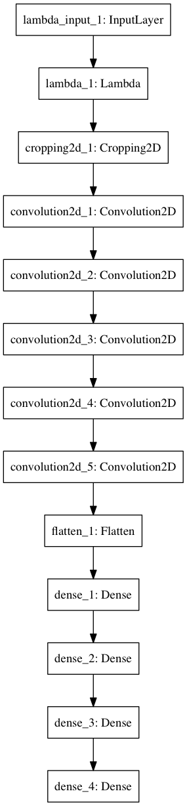
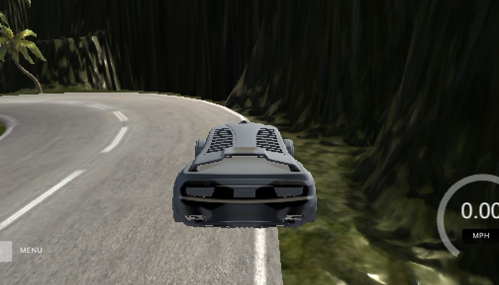

# **Behavioral Cloning**

### Stephan Brinkmann

---
## Preview

Here's the car racing around track 2:

[](https://www.youtube.com/watch?v=tyRiq3tCtVM)

More details below.


---

## Rubric Points
### Here I will consider the [rubric points](https://review.udacity.com/#!/rubrics/432/view) individually and describe how I addressed each point in my implementation.  

---
### Files Submitted & Code Quality

#### 1. Submission includes all required files and can be used to run the simulator in autonomous mode

My project includes the following files:

* model.py containing the script to create and train the model
* drive.py for driving the car in autonomous mode
* model.h5 containing a trained CNN
* writeup_report.pdf summarizing the results

Videos:

* video.mp4: car driving around first track
* track1_reverse_25.mp4: car driving around first track in reverse
* track2_23.mp4: car driving around second track
* track2_reverse_23.mp4: car driving around second track in reverse


#### 2. Submission includes functional code
Using the Udacity provided simulator and my drive.py file, the car can be driven autonomously around the track by executing
```sh
python drive.py model.h5
```

#### 3. Submission code is usable and readable

The model.py file contains the code for training and saving the convolution neural network. The file shows the pipeline I used for training and validating the model, and it contains comments to explain how the code works.

### Model Architecture and Training Strategy

#### 1. An appropriate model architecture has been employed

My model is based on the NVIDIA architecture from their paper [End to End Learning for Self-Driving Cars](http://images.nvidia.com/content/tegra/automotive/images/2016/solutions/pdf/end-to-end-dl-using-px.pdf).

It uses 5 convolutional layers and 4 dense layers with different filter numbers and sizes. All conv layers use RELU activation for non-linearity (model.py lines 88--105).

The preprocessing includes normalizing and mean centering the data using a lambda layer (line 91), as well as cropping the images vertically with a Cropping2D layer (line 92).

#### 2. Attempts to reduce overfitting in the model

Since the model does not seem to be overfitting very much, dropout or other regularization methods are not necessary.

The model was trained and validated on different data sets to ensure that the model was not overfitting (lines 40--84). The model was tested by running it through the simulator on four tracks (both tracks normal/reverse) at various speeds to ensure that the vehicle could stay on the track.

#### 3. Model parameter tuning

The model uses an Adam optimizer, so the learning rate did not need to be tuned manually (line 108).

#### 4. Appropriate training data

In addition to the training data provided by Udacity, extra data was generated using track 2. Center, left, and right images were used (lines 59--73) with a steering factor applied to the angle. Furthermore, all training data was augmented by mirrored versions of the images (lines 76--77).

For more details, see the next section.

### Model Architecture and Training Strategy

#### 1. Solution Design Approach

Right from the beginning, I started with the NVIDIA model, since I thought that would be the best bet. Alternatively, I considered trying the [comma.ai architecture](https://github.com/commaai/research/blob/master/train_steering_model.py), but that turned out not to be necessary.

I decided to use an Adam optimizer and mean squared error (MSE) as the loss function (instead of crossentropy, since this is a regression problem).

With a standard 80/20 split for training and validation data, I did a quick traineing using just the first 250 data points (center/left/right images and the angle) from Udacity's provided dataset for 5 epochs. MSE loss was very low on both training and validation data, which implied that my model was neither under- nor (strongly) overfitting.

Testing that model in the simulator, the car got until just after the bridge before veering of to the right. Still, I was very happy with my model, and decided to focus on training with more data, as well as gathering additional data (see section 3).

#### 2. Final Model Architecture

The final model is basically the NVIDIA architecture.

Here is the Keras visualization:



And a list of all layers used.

| Layer         		|     Description	           	   |
|:----------------------|---------------------------------:|
| Input         		| 160x320x3 RGB image   		   |
| Lambda		     	| Normalizing + mean centering. Output 160x320x3 	|
| Cropping2D	     	| Cropping top and bottom. Output 65x318x3 	|
| Convolution2D	     	| 24 filters, 5x5 kernel, 2x2 subsampling, RELU activation. Output 31x157x24 	|
| Convolution2D	     	| 36 filters, 5x5 kernel, 2x2 subsampling, RELU activation. Output 14x77x36 	|
| Convolution2D	     	| 48 filters, 5x5 kernel, 2x2 subsampling, RELU activation. Output 5x37x48 	|
| Convolution2D	     	| 64 filters, 3x3 kernel, RELU activation. Output 3x35x64 			|
| Convolution2D	     	| 64 filters, 3x3 kernel, RELU activation. Output 1x33x64 			|
| Flatten	    | Output 2112 		|
| Dense	/ FC   	| Output 100 		|
| Dense	/ FC   	| Output 50 		|
| Dense	/ FC   	| Output 10 		|
| Dense	/ FC   	| Output 1 			|

#### 3. Creation of the Training Set & Training Process

After training my model using just parts of Udacity's data (see above) and getting good results, I did a full run (5 epochs, batch size 64) using the complete data set (including center/left/right images with appropriate angles, augmented with mirrored versions of all images/angles).

This gave me a model that was good enough to drive track 1 on low speeds, but failed at higher velocities. On track 2, my model only got to the first or second turn.

I then collected additional data, doing 3 normal laps and 3 reverse laps on track 2. My driving was pretty aggressive, mostly center lane driving but with racing line driving for turns. No "recoveries" were recorded.

This netted me 11,494 additional data points (34,482 images, 11,494 angles).

For augmentation, I simply flipped all images (mirroring), and adjusted the angle accordingly (lines 76--77).

In total, this gave me 117,180 samples, 93,744 for training, and 23,436 for validation.

As mentioned above, this data was then preprocessed directly in Keras:

* Normalization
* Mean centering
* Cropping

During training, the data was fed into the model using a Python generator, that took care of loading the images and angles, preprocessing the images, as well as shuffling the data set (lines 49--84).

I also implemented a MSE loss history visualization (lines 111--122), which always segfaulted with big data sets, but was used in first trainings with partial data sets.

After another round of training for 5 epochs using the additional and original data, I tried the car on the test tracks again.

#### 4. Results

##### Track 1

The model is able to drive the car around track 1 (both directions) at full speed (30 mph). The car tends to swerve a little on straights, so I reduced the speed to 25 mph, which results in a pretty smooth driving experience. Lowering the speed further to about 20 mph makes all "swervey" tendencies on straights vanish.

##### Track 2

Track 2 is mastered by the model in both directions up to a speed of around 23--24 mph.

I initially tried higher speeds, to test the model's limits

* At 30 mph, the car crashed after around a third of the track, but recovers, and then ultimately crashes on the bridge.
* At 28 mph, the car is able to complete >90% of track 2, but then crashes fatally.
* At 25--27 mph, the car leaves the road surface briefly at the same spot where it crashed at 28 mph, but completes the track.

The location of the crash / surface leave right before the finishing straight:


##### Videos

Videos showcasing completion of both tracks in both directions are provided.

Speeds used are 25 mph for track 1, and 23 mph for track 2.
